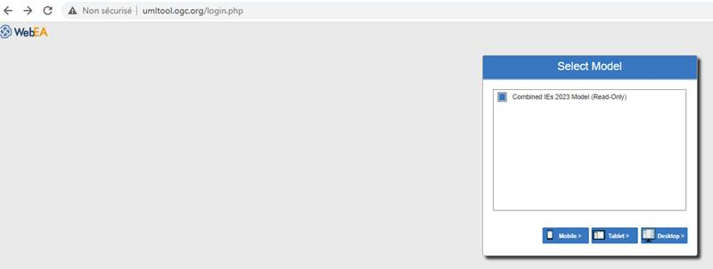
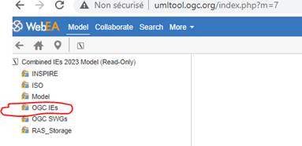
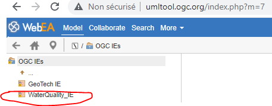
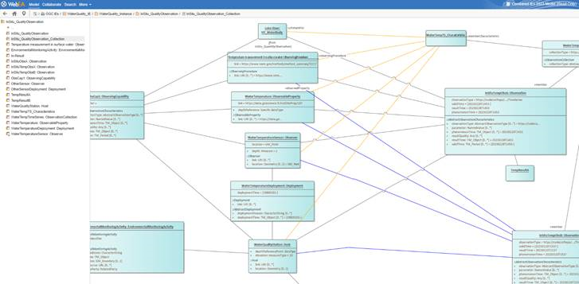

# WebAccess (HTML View)

0. http://umltool.ogc.org/login.php
1. Tick  « Combined IEs 2023 Model (Read-Only) » and choose Desktop (if you’re on a laptop)

2. then ‘OGC IEs’

3. then WaterQuality IE

4. and explore

Note : in all the other diagrams, you can come back using the arrow (just right above ‘GeoTech IE’ in the image above)

